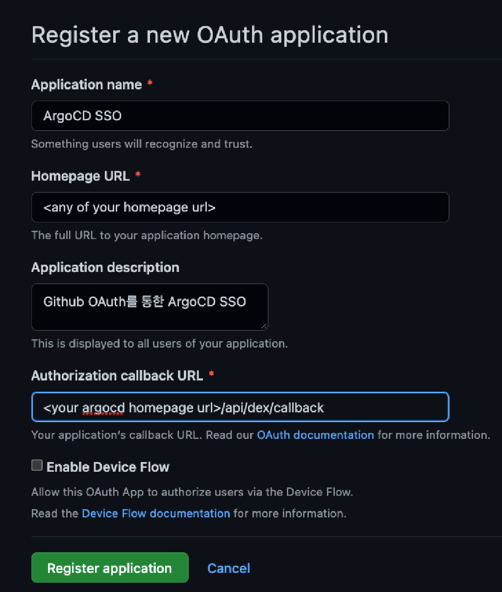

# ArgoCD Github SSO 및 RBAC

> 참고자료: https://umi0410.github.io/blog/devops/declarative-argocd-helm-rbac/

Github 계정을 ArgoCD 와 연동하고, 역할(Role)에 따라 ArgoCD 의 권한을 제어하는 방법을 알아보자.

RBAC 이 아닌 ArgoCD Local user 를 이용할 수도 있지만, Local user 를 사용하면 admin 계정의 패스워드를 암기하거나 새로운 팀원에게 새 계정을 생성해서 전달하는 번거로움이 있다.

그래서 Github 계정마다 역할을 부여하고, 역할에 따라 ArgoCD 를 이용할 수 있는 권한을 제어할 수 있다.

우선 ArgoCD 에서 RBAC 을 설정해주어야 한다.

Helm Chart 를 통해 배포한 ArgoCD 는 values.yaml 을 통해 RBAC 을 설정할 수 있다.

기본 원리는 아래와 같다.

- `p, <role/user/group>, <resource>, <action>, <appproject>/<object>` - AppProject에 속한 Object(e.g. Application)에 대한 권한을 정의한다.
- `p, <role/user/group>, <resource>, <action>, <object>` - AppProject에 속하지 않는 Object(e.g. Clusters, AppProject, Repositories, …)에 대한 권한을 정의한다.

바로 위에서 언급된 Resource 나 Action 은 아래와 같다.

- **Resources**: `clusters`, `projects`, `applications`, `repositories`, `certificates`, `accounts`, `gpgkeys`
- **Actions**: `get`, `create`, `update`, `delete`, `sync`, `override`, `action`

공식 문서에 따르면 Github SSO 를 이용해서 인증하면 RBAC 은 다음과 같이 설정할 수 있다고 한다.

```
p, role:org-admin, applications, *, */*, allow
p, role:org-admin, clusters, get, *, allow
p, role:org-admin, repositories, get, *, allow
p, role:org-admin, repositories, create, *, allow
p, role:org-admin, repositories, update, *, allow
p, role:org-admin, repositories, delete, *, allow

g, your-github-org:your-team, role:org-admin
```

p, role:org-admin, applications, _, _/\*, allow 을 해석하면 아래와 같다.

- `org-admin` 이라는 역할을 가진 사용자에게 모든 `applications` 에 대한 모든 작업(`*, */*`)을 허용(`allow`)한다.

마찬가지로 g, your-github-org:your-team, role:org-admin 을 해석하면 아래와 같다.

- Github 조직의 `your-team` 이라는 이름을 가진 팀에 소속된 사용자들을 `org-admin` 역할로 설정한다. 그리고 이 사용자들은 위에서 정의한 `org-admin` 이라는 역할에 허용된 권한들을 갖는다.

## RBAC 적용해보기

RBAC 을 아래와 같은 요구사항에 따라 적용한다고 해보자.

- 나의 Github Organization 중에서 `42cluster-dev` 내부의 `42cluster-devops` 팀의 사용자들은 admin 권한을 갖는다.
- 나의 Github Organization 중에서 `42cluster-dev` 내부의 `42cluster-developer` 팀의 사용자들은 readonly 권한을 갖는다.

위의 요구사항을 만족하는 values.yaml 은 아래와 같이 작성할 수 있다.

```yaml
# values.yaml
server:
  rbacConfig:
    policy.csv: |
      g, 42cluster-dev:42cluster-developer, role:readonly
      g, 42cluster-dev:42cluster-devops, role:admin
```

그 다음 RBAC 설정을 적용하기 위해 아래의 명령어를 실행해서 helm release 를 update 해주면 된다.

```bash
helm upgrade -n argocd argocd \
  argo/argo-cd -f values.yaml
```

## ArgoCD 에 Github 를 이용한 SSO 설정하기

ArgoCD 에는 Dex 라는 쿠버네티스 클러스터 내에서 다양한 서비스에 대한 사용자를 식별하고 인증하는 기능을 담당하는 컴포넌트가 있다.



위의 사진은 Github OAuth 를 생성하기 위한 Github 페이지의 사진이다. (42 인트라에서 OAuth App 생성하는 거랑 동일함)

OAuth App 을 등록하면 생성되는 `Client ID` 와 `Client Secret` 을 `dex.config` 에 전달하면 된다.

`dex.config` 는 `argocd-cm` 이라는 Configmap 의 `.data` 의 필드로 존재한다. 그래서 Helm chart 의 values.yaml 에 `dex.config` 를 올바르게 전달해야 한다.

이를 위해서는 `server.config.dex.config` 를 아래와 같이 작성해주면 된다.

```yaml
server:
  config:
    dex.config: |
      connectors:
      # Github OAuth를 통해 SSO하려는 경우
      - type: github
        id: github # 상관 없을 듯 뭘로 하든
        name: GitHub # 상관 없을 듯 뭘로 하든
        config:
          clientID: <your github oauth app client id>
          clientSecret: <your github oauth app client secret>
          orgs:
          - name: <your github organization name> # e.g. khu-dev
```

그 다음 아래의 명령어를 실행해서 RBAC 설정을 적용한다.

```bash
helm upgrade -n argocd argocd \
  argo/argo-cd -f values.yaml
```

그러면 아래의 이미지와 같이 Github 로그인 버튼이 표시된다.


요구사항에 맞춰서 `42cluster-dev` 라는 Github Organization 의 `42cluster-developer` 팀에 속한 계정으로 ArgoCD 에 로그인하면 하고 `<your argocd url>/user-info` 로 이동하면 아래와 같은 화면이 표시된다.


이 계정으로 어떤 Application 을 Sync 하려고 해도 `42cluster-dev:42cluster-developer` 는 readonly 만 부여받았기 때문에 어떠한 App 도 Sync 할 권한이 없어서 아래의 사진과 같이 Permission Denied 라는 에러가 표시된다.


