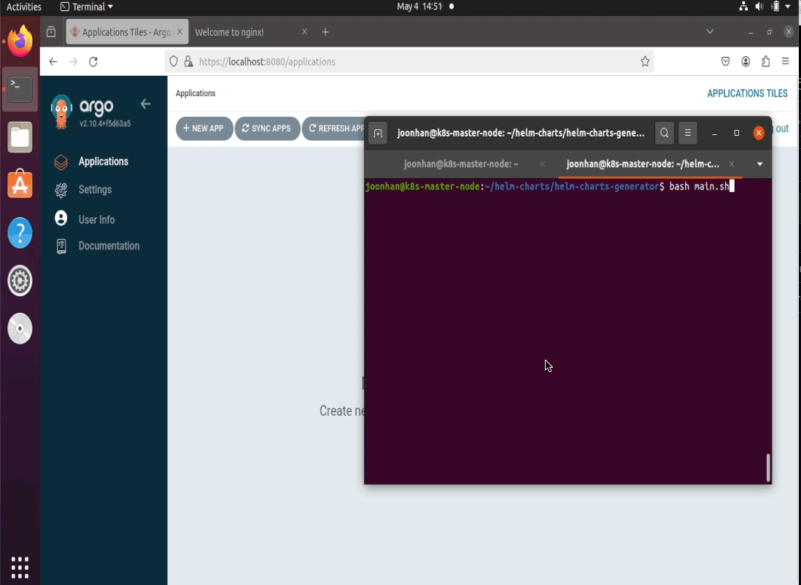
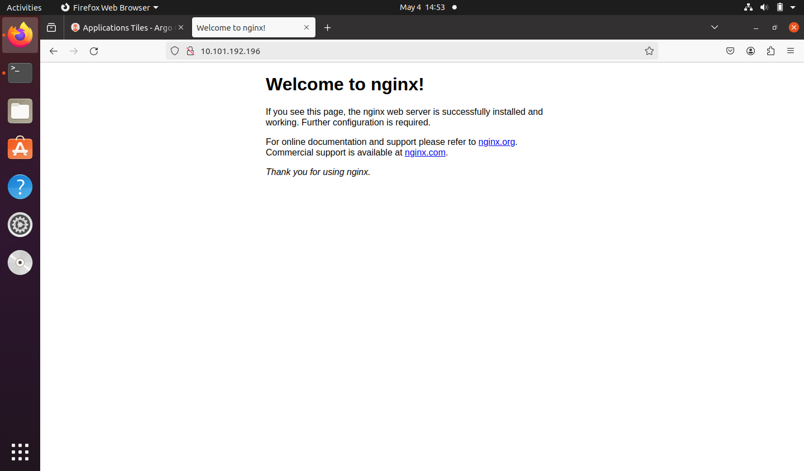
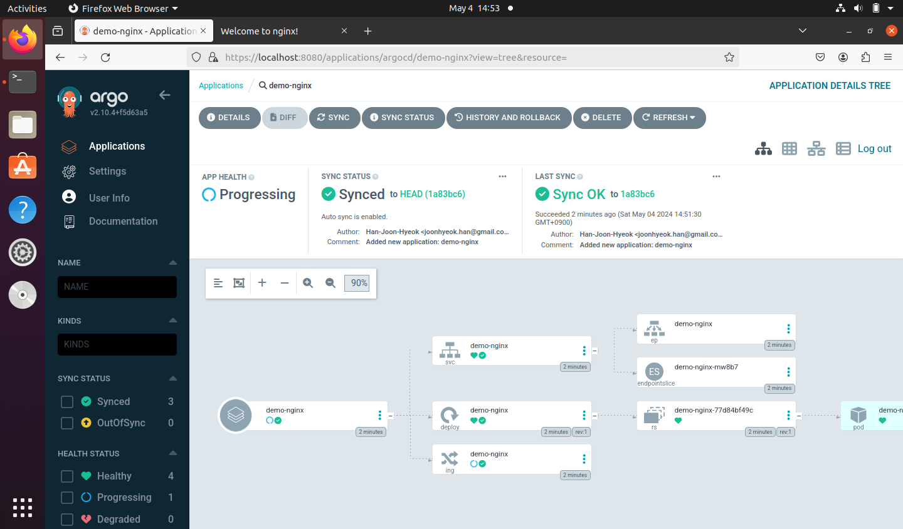

# 개요

Helm Chart 를 이용해서 애플리케이션을 Argo CD 로 배포하는 과정을 정리했습니다.

## 실행 환경

- OS: Ubuntu 20.04 Desktop
- Helm: v3.14.4
- ArgoCD: v2.9.7

# 작업 과정

## 1. Helm Chart 저장하기 위한 Github Repository 생성

42Cluster-Seoul 의 Github Organization 에 `helm-charts` 라는 이름의 [Repository](https://github.com/42Cluster-Seoul/helm-charts) 를 생성했습니다.

Github 를 이용해서 Helm Repo 생성을 하기 위해 Github Pages 설정도 함께 했습니다.

> 참고자료
>
> - [0. 사전준비: github에 helm repository 만들기](https://happycloud-lee.tistory.com/6) [티스토리]

Helm Chart 를 Argo CD 로 배포하기 위해 사용한 방법은 2가지입니다.

1. Github Pages 을 이용한 Helm Repository
2. Github Repository 의 Helm Chart 경로 지정

작업한 Github Repository 에는 2번 방식을 기준으로 Shell Script 가 작성되어 있습니다만, 1번 방식도 정상적으로 작동하는 것을 확인했습니다.

자세한 내용은 **[3. Shell Script 작동 원리]** 에서 설명하겠습니다.

## 2. Helm Chart 생성을 위한 Shell Script 작성

사용자의 입력을 받아서 Helm Chart 를 생성하는 Shell Script 를 작성했습니다.

Shell Script 는 `helm-charts` Github Repository 에 `helm-charts-generator` 디렉토리 하위에 `main.sh` 에 있습니다.

```bash
.
├── README.md
├── helm-charts-generator
│   ├── main.sh
│   └── template
│       ├── Chart.yaml.template
│       ├── templates
│       │   ├── application.yaml
│       │   ├── deployment.yaml
│       │   ├── ingress.yaml
│       │   └── service.yaml
│       └── values.yaml.template
└── stable
```

`main.sh` 코드는 아래와 같습니다.

```bash
read -p "Enter the value for application name: " app_name

# Variables
OUTPUT_DIRECTORY="../stable"
DESTINATION_DIRECTORY="$OUTPUT_DIRECTORY/$app_name"
OUTPUT_CHARTS_FILE="$DESTINATION_DIRECTORY/Chart.yaml"
OUTPUT_VALUES_FILE="$DESTINATION_DIRECTORY/values.yaml"
HELM_TEMPLATES_DIRECTORY="template/templates"
GITHUB_REPOSITORY="https://github.com/42Cluster-Seoul/helm-charts"

if [ ! -d "$DESTINATION_DIRECTORY" ]; then
  mkdir -p "$DESTINATION_DIRECTORY"
else
  rm -rf "$DESTINATION_DIRECTORY"
  mkdir -p "$DESTINATION_DIRECTORY"
fi

cp template/values.yaml.template $OUTPUT_VALUES_FILE
cp template/Chart.yaml.template $OUTPUT_CHARTS_FILE

sed -i.tmp "s/\${app_name}/$app_name/g" $OUTPUT_CHARTS_FILE

read -p "Enter replicas count: " replicas_count
read -p "Enter image url: " image_url
read -p "Enter port number: " port_number

sed -i.tmp \
    -e "s/\${app_name}/$app_name/g" \
    -e "s/\${replicas_count}/$replicas_count/g" \
    -e "s/\${image_url}/$image_url/g" \
    -e "s/\${port_number}/$port_number/g" \
    "$OUTPUT_VALUES_FILE"

rm -f "$OUTPUT_CHARTS_FILE.tmp" "$OUTPUT_VALUES_FILE.tmp"

cp -r "$HELM_TEMPLATES_DIRECTORY" "$DESTINATION_DIRECTORY"

sed -i.tmp "s/\${app_name}/$app_name/g" "$DESTINATION_DIRECTORY/templates/application.yaml"

rm -f "$DESTINATION_DIRECTORY/templates/application.yaml.tmp"

mv "$DESTINATION_DIRECTORY/templates/application.yaml" "$OUTPUT_DIRECTORY/$app_name-applcation.yaml"

echo -e "\n🪽 New Helm Charts created with app name: $app_name \n"

echo -e "✅ Lint Check for application: $app_name\n"

helm lint $DESTINATION_DIRECTORY

echo -e "⏫ Uploading Helm Chart to Github Repository: $GITHUB_REPOSITORY \n"

git add $OUTPUT_DIRECTORY
git commit -m "Added new application: $app_name"
git push origin main

echo -e "\n🚀 Applying for application: $app_name-application.yaml\n"

kubectl create -f $OUTPUT_DIRECTORY/$app_name-applcation.yaml
```

작동 순서는 아래와 같습니다.

### (1) 애플리케이션 정보 입력

아래와 같이 4가지 정보를 입력 받습니다.

1. 애플리케이션 이름: 배포하고자 하는 애플리케이션의 이름
2. Replicas 개수: 실행할 파드의 개수
3. Image URL: 파드에 배포할 애플리케이션의 이미지(DockerHub 등)의 URL
4. 포트 번호: Ingress 를 사용하기 위한 포트 번호

### (2) 입력 받은 정보를 템플릿에 입력

`sed` 명령어를 이용해서 표준 입력으로 받은 값을 템플릿에 치환합니다.

### (3) Helm Lint 수행

`stable/${app_name}` 경로에 생성된 Helm Chart 관련 yaml 파일들의 문법을 확인하기 위해 `helm lint` 를 수행합니다.

### (4) Github Repository Push

`stable` 경로에 생성된 파일을 `helm-charts` Repository 에 업로드합니다.

### (5) Argo CD 배포

`kubectl create -f stable/${app_name}-application.yaml` 명령어를 이용해서 애플리케이션을 배포합니다.

## 3. Shell Script 작동 원리

`helm-charts-generator/template` 경로에는 Helm Chart 를 구성하기 위한 Chart.yaml, values.yaml, 그리고 애플리케이션 구성을 위한 deployment, service, ingress, application(ArgoCD CRD) 템플릿이 있습니다.

사용자로부터 받은 입력 값을 템플릿 파일들에 입력해서 `stable/${app_name}` 경로에 저장합니다.

이때, application.yaml 은 Helm Chart 와 섞이지 않도록 `stable` 경로에 저장합니다.

`stable` 디렉토리 구조는 아래와 같습니다.

```bash
stable
├── demo-nginx
│   ├── Chart.yaml
│   ├── templates
│   │   ├── deployment.yaml
│   │   ├── ingress.yaml
│   │   └── service.yaml
│   └── values.yaml
├── demo-nginx-0.1.0.tgz
├── demo-nginx-applcation.yaml
└── index.yaml
```

`demo-nginx` 는 Shell Script 로 입력한 애플리케이션 이름입니다.

실행하는 모습은 아래와 같습니다.



### application.yaml

Argo CD 에서 Helm Chart 를 이용해서 배포할 때 2가지 방법을 지원합니다.

첫 번째는 Github Repository 내 Helm Chart 경로를 지정하는 것입니다.

`stable/${app_name}` 경로에는 yaml 파일들로 구성되어 있습니다.

```bash
stable/demo-nginx
├── Chart.yaml
├── templates
│   ├── deployment.yaml
│   ├── ingress.yaml
│   └── service.yaml
└── values.yaml
```

이 경로를 application.yaml 에 입력해서 배포할 Helm Chart 를 지정할 수 있습니다.

```yaml
spec:
  project: default
  source:
    path: stable/${app_name}
    repoURL: https://github.com/42Cluster-Seoul/helm-charts
    targetRevision: HEAD
    helm:
      valueFiles:
        - values.yaml
```

`${app_name}-application.yaml` 파일은 `stable` 경로에 저장됩니다.

```bash
stable
├── demo-nginx
│   ├── Chart.yaml
│   ├── templates
│   │   ├── deployment.yaml
│   │   ├── ingress.yaml
│   │   └── service.yaml
│   └── values.yaml
└── demo-nginx-applcation.yaml
```

두 번째는 Helm Repo 를 이용하는 방법입니다.

application.yaml 에 입력하는 것은 거의 유사합니다.

repoURL 에 Github Pages 로 생성한 Helm Repo 를 입력하고, `source.chart` 속성에 chart 이름을 입력해주는 것이 차이점입니다.

```yaml
spec:
  project: default
  source:
    chart: demo-nginx
    repoURL: https://42cluster-seoul.github.io/helm-charts/stable
    targetRevision: 0.1.0
    helm:
      valueFiles:
        - values.yaml
```

이를 이용하기 위해서 `stable` 경로에 Helm Chart 의 `index.yaml` 파일과 압축한 패키지 파일을 함께 업로드 했습니다.

```bash
stable
├── demo-nginx
│   ├── Chart.yaml
│   ├── templates
│   │   ├── deployment.yaml
│   │   ├── ingress.yaml
│   │   └── service.yaml
│   └── values.yaml
├── demo-nginx-0.1.0.tgz
├── demo-nginx-applcation.yaml
└── index.yaml
```

테스트 목적으로 nginx 를 배포했고, Cluster IP 로 접근하면 아래와 같은 화면이 뜹니다.



다만, Ingress 설정을 잘못했는지, 현재는 아래의 이미지와 같이 Ingress 가 제대로 설치되지 않는 상태입니다.


